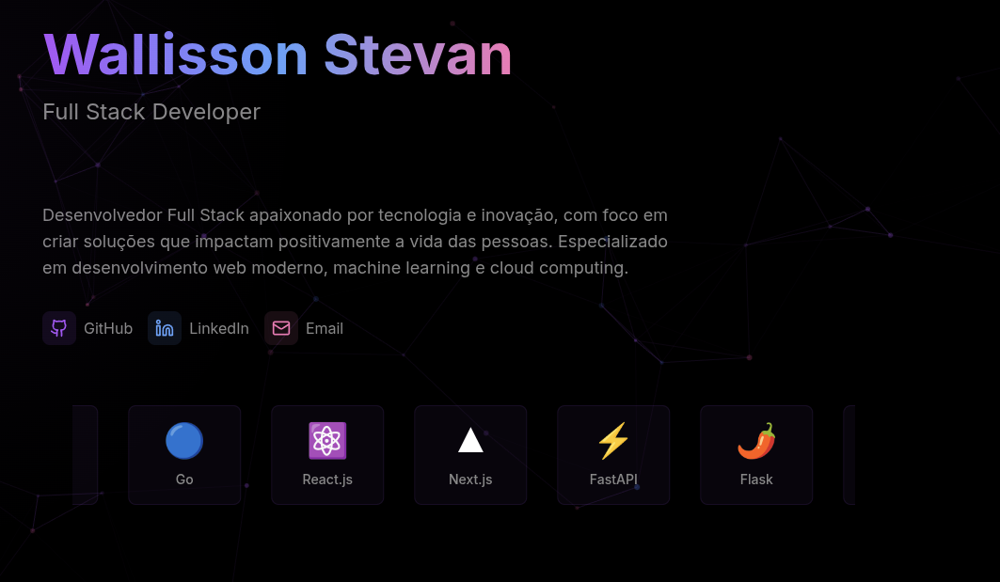
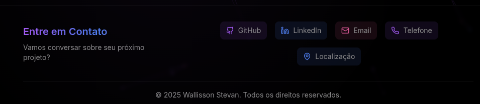

# Portfolio Pessoal

Criei este portfolio para mostrar meus projetos e habilidades. Usei Next.js, TypeScript e Tailwind CSS.

## Demonstração Visual

Abaixo algumas telas do projeto:

<p align="center">
  
  
  
</p>

## Características

- Design responsivo e moderno
- Efeito de partículas interativas com tsParticles
- Animações suaves com Framer Motion
- Integração com GitHub API para exibição automática de projetos
- Tema escuro com gradientes e efeitos de vidro
- Links de contato diretos no rodapé
- Otimizado para SEO
- Totalmente tipado com TypeScript

## Tecnologias Utilizadas

- **Framework**: Next.js 14
- **Linguagem**: TypeScript
- **Estilização**: Tailwind CSS
- **Animações**: Framer Motion
- **Partículas**: tsParticles
- **Ícones**: Lucide React
- **Integração GitHub**: Octokit
- **Formatação**: Prettier
- **Linting**: ESLint

## Requisitos

- Node.js 18.17 ou superior
- npm ou yarn

## Estrutura do Projeto

```
portfolio/
├── app/              
│   ├── components/    
│   ├── layout.tsx      
│   └── page.tsx        
├── public/             
│   └── assets/         
├── styles/             
│   └── globals.css
├── types/              
│   └── index.d.ts
├── next.config.js
├── tailwind.config.ts 
├── tsconfig.json
└── package.json
```

## Como Executar

1. Clone o repositório:
   ```bash
   git clone https://github.com/wstvns/portfolio
   cd portfolio
   ```

2. Instale as dependências:
   ```bash
   npm install
   ```

3. Execute o servidor de desenvolvimento:
   ```bash
   npm run dev
   ```

4. Abra [http://localhost:3000](http://localhost:3000) no seu navegador.

## Scripts Disponíveis

- `npm run dev` - Inicia o servidor de desenvolvimento
- `npm run build` - Cria a versão de produção
- `npm run start` - Inicia o servidor de produção
- `npm run lint` - Executa a verificação de linting
- `npm run format` - Formata os arquivos com Prettier
- `npm run type-check` - Verifica os tipos TypeScript

## Configuração

### Configuração do TypeScript

O projeto usa uma configuração TypeScript otimizada para Next.js 14:
```json
{
  "compilerOptions": {
    "target": "es5",
    "lib": ["dom", "dom.iterable", "esnext"],
    "moduleResolution": "node"
    // ...
  }
}
```

### Personalização

1. **Tema**: Edite `tailwind.config.ts` para personalizar cores e outros valores do tema
2. **Partículas**: Ajuste a configuração em `components/ParticlesBackground.tsx`
3. **Conteúdo**: Atualize os componentes em `app/components/` com suas informações

## Responsividade

O site é totalmente responsivo e otimizado para:
- Dispositivos móveis (< 768px)
- Tablets (768px - 1024px)
- Desktop (> 1024px)

## Design System

### Cores
- **Primary**: #A855F7 (Roxo)
- **Secondary**: #3B82F6 (Azul)
- **Accent**: #EC4899 (Rosa)
- **Background**: Sistema de cores escuro personalizado
- **Text**: Sistema de cores claro com opacidades variadas

### Tipografia
- **Títulos**: Sistema de fontes sans-serif
- **Corpo**: Sistema de fontes sans-serif
- **Tamanhos**: Escala personalizada via Tailwind


## Suporte e Contato


- **GitHub**: [@wstvns](https://github.com/wstvns)
- **LinkedIn**: [Wallisson Stevan](https://linkedin.com/in/wallisson-stevan-985b9375/)
- **Email**: wstevandev@gmail.com

Feito com ❤️ por [W. Stevan](https://www.youtube.com/watch?v=wi8yJdKO1j0). ⬅️ abra para uma surpresa!
